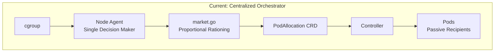
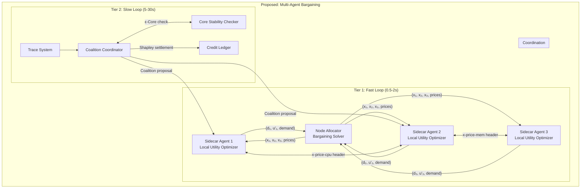

# Implementation Roadmap: Theory → Code
## Transforming MBCAS into a True Collaborative Game-Theoretic System

This document maps the theoretical framework to concrete implementation changes in your codebase.

---

## 1. Architecture Transformation

### Current Architecture (Centralized)



### Proposed Architecture (Distributed Collaborative)



---

## 2. Component-by-Component Implementation

### 2.1 The Utility Function (NEW FILE)

**File:** `pkg/allocation/utility.go`

This replaces the heuristic `computeNeed()` with a formal utility function.

```go
package allocation

import (
    "math"
    "k8s.io/apimachinery/pkg/types"
)

// UtilityParams defines the parameters for computing agent utility.
// Based on: u_i(x) = w_i · SLOScore_i(x) - λ_cpu·x^cpu - λ_mem·x^mem
type UtilityParams struct {
    // SLO-related
    TargetLatencyMs   float64 // Target p99 latency
    CurrentLatencyMs  float64 // Observed p99 latency
    SLOWeight         float64 // w_i: importance of SLO satisfaction
    
    // Resource costs (shadow prices from previous epoch)
    LambdaCPU  float64 // λ_cpu: cost per millicore
    LambdaMem  float64 // λ_mem: cost per MB
    LambdaConn float64 // λ_conn: cost per connection token
    
    // Disagreement point (baseline rights)
    BaselineCPU  int64 // d_i^cpu: minimum viable CPU
    BaselineMem  int64 // d_i^mem: minimum viable memory
    BaselineConn int64 // d_i^conn: minimum viable connections
    
    // Current allocation
    AllocCPU  int64
    AllocMem  int64
    AllocConn int64
    
    // Bounds
    MaxCPU  int64
    MaxMem  int64
    MaxConn int64
}

// Utility computes the utility value for an agent given current allocation.
// u_i(x) = w_i · SLOScore(x) - Σ λ_r · x_r
//
// SLOScore uses a sigmoid function to model diminishing returns:
// SLOScore = 1 / (1 + exp(k · (latency - target)))
//
// This guarantees:
// - Concavity (diminishing returns)
// - Bounded output [0, 1] for SLO satisfaction
// - Smooth gradients for optimization
func (p *UtilityParams) Utility() float64 {
    sloScore := p.SLOScore()
    
    resourceCost := p.LambdaCPU*float64(p.AllocCPU) +
                    p.LambdaMem*float64(p.AllocMem) +
                    p.LambdaConn*float64(p.AllocConn)
    
    return p.SLOWeight*sloScore - resourceCost
}

// SLOScore computes SLO satisfaction using a sigmoid function.
// Returns value in [0, 1] where 1 = perfect satisfaction.
//
// Mathematical form: σ(x) = 1 / (1 + exp(k·(latency - target)))
// where k controls the steepness of the transition.
func (p *UtilityParams) SLOScore() float64 {
    if p.TargetLatencyMs <= 0 {
        return 1.0 // No SLO defined
    }
    
    // Steepness parameter (higher = sharper transition at target)
    k := 0.1
    
    // Sigmoid: approaches 1 when latency < target, 0 when latency >> target
    exponent := k * (p.CurrentLatencyMs - p.TargetLatencyMs)
    return 1.0 / (1.0 + math.Exp(exponent))
}

// MarginalUtility computes ∂u/∂x_cpu (gradient for optimization).
// Used by the bargaining solver to find optimal allocation.
//
// For resource r: ∂u/∂x_r = w_i · (∂SLO/∂x_r) - λ_r
func (p *UtilityParams) MarginalUtilityCPU() float64 {
    // Approximate ∂SLO/∂CPU via finite difference
    // In practice, this should be learned from historical data
    epsilon := int64(10) // 10m perturbation
    
    original := p.AllocCPU
    p.AllocCPU = original + epsilon
    sloPlus := p.SLOScore()
    p.AllocCPU = original - epsilon
    sloMinus := p.SLOScore()
    p.AllocCPU = original
    
    dSLO_dCPU := (sloPlus - sloMinus) / float64(2*epsilon)
    
    return p.SLOWeight*dSLO_dCPU - p.LambdaCPU
}

// Surplus computes allocation above disagreement point.
// surplus_i = x_i - d_i (clamped to >= 0)
func (p *UtilityParams) SurplusCPU() int64 {
    surplus := p.AllocCPU - p.BaselineCPU
    if surplus < 0 {
        return 0
    }
    return surplus
}

// LogSurplus computes log(x_i - d_i) for Nash product.
// Returns -Inf if at or below baseline (which is correct for Nash product).
func (p *UtilityParams) LogSurplusCPU() float64 {
    surplus := p.SurplusCPU()
    if surplus <= 0 {
        return math.Inf(-1)
    }
    return math.Log(float64(surplus))
}
```

---

### 2.2 True Nash Bargaining Solver (REPLACE `market.go`)

**File:** `pkg/allocation/nash_bargaining.go`

This replaces `nashReduce()` with a mathematically correct implementation.

```go
package allocation

import (
    "math"
    "sort"
    
    "k8s.io/apimachinery/pkg/types"
)

// NashBargainingParams holds the parameters for Nash Bargaining Solution.
type NashBargainingParams struct {
    UID           types.UID
    Weight        float64 // w_i: bargaining power (from K8s request or priority)
    Baseline      int64   // d_i: disagreement point (minimum allocation)
    MaxAlloc      int64   // Maximum allocation (from K8s limit)
    MarginalUtil  float64 // ∂u_i/∂x_i: marginal utility at current allocation
    Demand        int64   // Requested allocation based on observed need
}

// NashBargainingSolution computes the Nash Bargaining Solution.
//
// Objective: max Π_i (x_i - d_i)^w_i  (weighted Nash product)
// Equivalent: max Σ_i w_i · log(x_i - d_i)  (convex optimization)
//
// Subject to:
//   Σ_i x_i ≤ C (capacity)
//   x_i ≥ d_i (individual rationality)
//   x_i ≤ max_i (bounds)
//
// Algorithm: Water-filling with weights
// 1. Everyone gets baseline d_i
// 2. Distribute surplus proportional to w_i until capacity exhausted or bounds hit
// 3. Redistribute excess from capped agents
func NashBargainingSolution(
    capacity int64,
    agents []NashBargainingParams,
) map[types.UID]int64 {
    if len(agents) == 0 {
        return make(map[types.UID]int64)
    }
    
    // Step 1: Compute total baseline and check feasibility
    totalBaseline := int64(0)
    totalWeight := 0.0
    for _, a := range agents {
        totalBaseline += a.Baseline
        totalWeight += a.Weight
    }
    
    availableSurplus := capacity - totalBaseline
    if availableSurplus < 0 {
        // Overloaded: scale baselines (emergency mode)
        return scaleBaselinesWeighted(agents, capacity)
    }
    
    // Step 2: Initial allocation = baseline + weighted share of surplus
    // Nash Bargaining with equal weights gives EQUAL surplus division
    // With weights: surplus_i ∝ w_i (this is the weighted NBS)
    allocations := make(map[types.UID]int64)
    remaining := availableSurplus
    uncapped := make([]NashBargainingParams, 0, len(agents))
    
    for _, a := range agents {
        // Weighted surplus share
        share := float64(availableSurplus) * (a.Weight / totalWeight)
        allocation := a.Baseline + int64(share)
        
        // Check if capped
        if allocation > a.MaxAlloc {
            allocations[a.UID] = a.MaxAlloc
            remaining -= (a.MaxAlloc - a.Baseline)
        } else {
            uncapped = append(uncapped, a)
            allocations[a.UID] = allocation
        }
    }
    
    // Step 3: Redistribute excess from capped agents
    if remaining > 0 && len(uncapped) > 0 {
        redistributeNashSurplus(allocations, uncapped, remaining)
    }
    
    return allocations
}

// redistributeNashSurplus handles the case where some agents hit their max.
// The excess is redistributed to uncapped agents proportional to weights.
func redistributeNashSurplus(
    allocations map[types.UID]int64,
    uncapped []NashBargainingParams,
    remaining int64,
) {
    // Compute weight sum of uncapped agents
    uncappedWeight := 0.0
    for _, a := range uncapped {
        uncappedWeight += a.Weight
    }
    
    if uncappedWeight == 0 {
        return
    }
    
    // Redistribute proportional to weights
    for _, a := range uncapped {
        extra := float64(remaining) * (a.Weight / uncappedWeight)
        newAlloc := allocations[a.UID] + int64(extra)
        
        // Clamp to max
        if newAlloc > a.MaxAlloc {
            newAlloc = a.MaxAlloc
        }
        allocations[a.UID] = newAlloc
    }
}

// scaleBaselinesWeighted handles overloaded case with weighted scaling.
// Each agent gets: x_i = (d_i · w_i / Σ(d_j · w_j)) · C
func scaleBaselinesWeighted(agents []NashBargainingParams, capacity int64) map[types.UID]int64 {
    allocations := make(map[types.UID]int64)
    
    weightedBaseline := 0.0
    for _, a := range agents {
        weightedBaseline += float64(a.Baseline) * a.Weight
    }
    
    if weightedBaseline == 0 {
        // All baselines zero: equal division
        share := capacity / int64(len(agents))
        for _, a := range agents {
            allocations[a.UID] = share
        }
        return allocations
    }
    
    scale := float64(capacity) / weightedBaseline
    for _, a := range agents {
        alloc := int64(float64(a.Baseline) * a.Weight * scale)
        if alloc < 10 { // Absolute minimum
            alloc = 10
        }
        allocations[a.UID] = alloc
    }
    
    return allocations
}

// VerifyNashAxioms checks that the solution satisfies Nash axioms.
// Returns nil if valid, error describing violation otherwise.
func VerifyNashAxioms(
    solution map[types.UID]int64,
    agents []NashBargainingParams,
    capacity int64,
) error {
    // Axiom 1: Pareto Optimality - all capacity should be used (or agents capped)
    totalAlloc := int64(0)
    allCapped := true
    for _, a := range agents {
        alloc := solution[a.UID]
        totalAlloc += alloc
        if alloc < a.MaxAlloc {
            allCapped = false
        }
    }
    
    if totalAlloc < capacity && !allCapped {
        return fmt.Errorf("Pareto violation: capacity %d, allocated %d, not all capped", 
            capacity, totalAlloc)
    }
    
    // Axiom 2: Individual Rationality - everyone >= baseline
    for _, a := range agents {
        if solution[a.UID] < a.Baseline {
            return fmt.Errorf("IR violation: agent %s got %d < baseline %d",
                a.UID, solution[a.UID], a.Baseline)
        }
    }
    
    // Axiom 3: Symmetry - equal weights → equal surplus (approximately)
    // (Only check if all weights equal)
    firstWeight := agents[0].Weight
    allEqual := true
    for _, a := range agents {
        if math.Abs(a.Weight-firstWeight) > 0.001 {
            allEqual = false
            break
        }
    }
    
    if allEqual && len(agents) > 1 {
        // Check surplus equality (within tolerance)
        surpluses := make([]int64, len(agents))
        for i, a := range agents {
            surpluses[i] = solution[a.UID] - a.Baseline
        }
        
        maxSurplus := surpluses[0]
        minSurplus := surpluses[0]
        for _, s := range surpluses {
            if s > maxSurplus { maxSurplus = s }
            if s < minSurplus { minSurplus = s }
        }
        
        // Allow 10% tolerance for rounding
        if maxSurplus > 0 && float64(maxSurplus-minSurplus)/float64(maxSurplus) > 0.1 {
            return fmt.Errorf("Symmetry violation: surplus range [%d, %d] with equal weights",
                minSurplus, maxSurplus)
        }
    }
    
    return nil
}
```

---

### 2.3 Coalition Formation & Core Stability (NEW FILE)

**File:** `pkg/coalition/coalition.go`

This implements the collaborative aspect via request-path coalitions.

```go
package coalition

import (
    "math"
    "k8s.io/apimachinery/pkg/types"
)

// Coalition represents a group of services on a shared request path.
type Coalition struct {
    ID        string
    Members   []types.UID
    PathID    string      // Trace/span path identifier
    Value     float64     // v(C): coalition value (latency reduction)
    Stable    bool        // Is in ε-core?
    Allocations map[types.UID]int64
}

// CoalitionGame represents the characteristic function v(S) for all subsets.
type CoalitionGame struct {
    Players   []types.UID
    Values    map[string]float64 // coalition key -> value
    Epsilon   float64            // ε for ε-core stability
}

// NewCoalitionFromPath creates a coalition from a trace path.
func NewCoalitionFromPath(pathID string, members []types.UID) *Coalition {
    return &Coalition{
        ID:      generateCoalitionID(pathID, members),
        Members: members,
        PathID:  pathID,
        Stable:  false,
    }
}

// ComputeValue calculates the coalition value.
// v(C) = latency reduction achievable by pooling resources
//
// For a request path A → B → C:
// v({A,B,C}) = baseline_latency - optimized_latency
//
// This is computed by solving the internal allocation problem
// for the coalition assuming it gets its fair share of capacity.
func (c *Coalition) ComputeValue(
    baselineLatency float64,
    capacityShare int64,
    memberParams map[types.UID]AllocationParams,
) float64 {
    // Solve internal Nash bargaining for coalition
    internalAllocs := solveInternalBargaining(c.Members, capacityShare, memberParams)
    
    // Estimate optimized latency with these allocations
    optimizedLatency := estimateLatency(internalAllocs, memberParams)
    
    c.Value = baselineLatency - optimizedLatency
    if c.Value < 0 {
        c.Value = 0 // Coalition can't make things worse than baseline
    }
    
    return c.Value
}

// IsInEpsilonCore checks if the current allocation is ε-core stable.
//
// Definition: An allocation x is in the ε-core if for all subsets S:
//   Σ_{i∈S} x_i ≥ v(S) - ε
//
// In words: no subset S can "block" by doing significantly better alone.
func (g *CoalitionGame) IsInEpsilonCore(allocations map[types.UID]int64) (bool, *BlockingCoalition) {
    n := len(g.Players)
    
    // Check all 2^n - 1 non-empty subsets (expensive but correct)
    // For production, use sampling or heuristics
    for mask := 1; mask < (1 << n); mask++ {
        subset := g.subsetFromMask(mask)
        if len(subset) == n {
            continue // Skip grand coalition
        }
        
        // Compute allocation sum for this subset
        subsetAlloc := int64(0)
        for _, uid := range subset {
            subsetAlloc += allocations[uid]
        }
        
        // Get coalition value for this subset
        subsetKey := coalitionKey(subset)
        subsetValue := g.Values[subsetKey]
        
        // Check blocking condition: v(S) - ε > Σ_{i∈S} x_i
        if subsetValue - g.Epsilon > float64(subsetAlloc) {
            return false, &BlockingCoalition{
                Members:     subset,
                Value:       subsetValue,
                CurrentSum:  subsetAlloc,
                Deficit:     subsetValue - float64(subsetAlloc),
            }
        }
    }
    
    return true, nil
}

// BlockingCoalition represents a subset that blocks the current allocation.
type BlockingCoalition struct {
    Members    []types.UID
    Value      float64 // v(S)
    CurrentSum int64   // Σ_{i∈S} x_i
    Deficit    float64 // v(S) - Σ x_i
}

// ResolveBlocking adjusts allocations to eliminate blocking coalition.
// Strategy: Increase allocation to blocking members at expense of non-members.
func (g *CoalitionGame) ResolveBlocking(
    allocations map[types.UID]int64,
    blocking *BlockingCoalition,
    capacity int64,
) map[types.UID]int64 {
    result := make(map[types.UID]int64)
    for k, v := range allocations {
        result[k] = v
    }
    
    // Calculate how much to transfer
    deficit := int64(math.Ceil(blocking.Deficit))
    
    // Take from non-blocking members (those not in blocking coalition)
    nonMembers := g.complement(blocking.Members)
    perNonMember := deficit / int64(len(nonMembers))
    
    for _, uid := range nonMembers {
        reduction := perNonMember
        // Don't reduce below baseline
        if result[uid] - reduction < 100 { // minimum baseline
            reduction = result[uid] - 100
        }
        result[uid] -= reduction
    }
    
    // Give to blocking members proportionally
    perBlockingMember := deficit / int64(len(blocking.Members))
    for _, uid := range blocking.Members {
        result[uid] += perBlockingMember
    }
    
    return result
}

// Helper functions

func (g *CoalitionGame) subsetFromMask(mask int) []types.UID {
    subset := make([]types.UID, 0)
    for i, uid := range g.Players {
        if mask&(1<<i) != 0 {
            subset = append(subset, uid)
        }
    }
    return subset
}

func (g *CoalitionGame) complement(subset []types.UID) []types.UID {
    inSubset := make(map[types.UID]bool)
    for _, uid := range subset {
        inSubset[uid] = true
    }
    
    complement := make([]types.UID, 0)
    for _, uid := range g.Players {
        if !inSubset[uid] {
            complement = append(complement, uid)
        }
    }
    return complement
}

func coalitionKey(members []types.UID) string {
    // Sort and concatenate for deterministic key
    sorted := make([]string, len(members))
    for i, uid := range members {
        sorted[i] = string(uid)
    }
    sort.Strings(sorted)
    return strings.Join(sorted, ",")
}
```

---

### 2.4 Shapley Value for Fair Attribution (NEW FILE)

**File:** `pkg/coalition/shapley.go`

```go
package coalition

import (
    "math"
    "math/rand"
    
    "k8s.io/apimachinery/pkg/types"
)

// ShapleyCredits tracks each service's accumulated contribution credits.
type ShapleyCredits struct {
    Credits map[types.UID]float64
    History []CreditTransaction
}

// CreditTransaction records a credit change.
type CreditTransaction struct {
    Timestamp  time.Time
    Agent      types.UID
    Delta      float64
    Reason     string // "helped_coalition", "consumed_burst", etc.
}

// ComputeShapleyValue computes the Shapley value for each agent.
//
// φ_i(v) = Σ_{S⊆N\{i}} [|S|!(n-|S|-1)!/n!] · [v(S∪{i}) - v(S)]
//
// This is the unique fair attribution satisfying:
// - Efficiency: Σ φ_i = v(N)
// - Symmetry: Symmetric players get equal value
// - Dummy: Players with zero marginal contribution get zero
// - Additivity: φ(v+w) = φ(v) + φ(w)
//
// Uses Monte Carlo approximation for efficiency (O(k·n) vs O(2^n))
func ComputeShapleyValue(
    game *CoalitionGame,
    samples int, // Number of Monte Carlo samples
) map[types.UID]float64 {
    n := len(game.Players)
    shapley := make(map[types.UID]float64)
    
    for i := 0; i < samples; i++ {
        // Random permutation (arrival order)
        perm := rand.Perm(n)
        
        // Track coalition as players "arrive"
        coalition := make([]types.UID, 0, n)
        prevValue := 0.0
        
        for _, idx := range perm {
            player := game.Players[idx]
            coalition = append(coalition, player)
            
            // Get coalition value
            key := coalitionKey(coalition)
            currValue := game.Values[key]
            
            // Marginal contribution = v(S∪{i}) - v(S)
            marginal := currValue - prevValue
            shapley[player] += marginal
            
            prevValue = currValue
        }
    }
    
    // Average over samples
    for uid := range shapley {
        shapley[uid] /= float64(samples)
    }
    
    return shapley
}

// UpdateCredits updates the credit ledger based on Shapley values.
// Called after each epoch to settle contributions.
func (sc *ShapleyCredits) UpdateCredits(
    shapleyValues map[types.UID]float64,
    actualConsumption map[types.UID]int64,
    epoch time.Time,
) {
    for uid, sv := range shapleyValues {
        // Credit = Shapley value - actual consumption
        // Positive = helped more than consumed (earns credits)
        // Negative = consumed more than helped (spends credits)
        consumption := float64(actualConsumption[uid])
        delta := sv - consumption
        
        sc.Credits[uid] += delta
        sc.History = append(sc.History, CreditTransaction{
            Timestamp: epoch,
            Agent:     uid,
            Delta:     delta,
            Reason:    "shapley_settlement",
        })
    }
}

// AdjustAllocationByCredits modifies allocations based on credit balance.
// Agents with positive credits get priority during contention.
func (sc *ShapleyCredits) AdjustAllocationByCredits(
    baseAllocations map[types.UID]int64,
    contention float64, // 0 = no contention, 1 = severe contention
) map[types.UID]int64 {
    if contention < 0.1 {
        return baseAllocations // No adjustment needed
    }
    
    result := make(map[types.UID]int64)
    
    // Normalize credits to adjustment factors
    maxCredit := 0.0
    minCredit := 0.0
    for _, c := range sc.Credits {
        if c > maxCredit { maxCredit = c }
        if c < minCredit { minCredit = c }
    }
    
    creditRange := maxCredit - minCredit
    if creditRange < 1 {
        return baseAllocations
    }
    
    // Adjustment: ±10% based on credit position
    for uid, base := range baseAllocations {
        credit := sc.Credits[uid]
        normalized := (credit - minCredit) / creditRange // [0, 1]
        adjustmentFactor := 0.9 + 0.2*normalized         // [0.9, 1.1]
        
        // Apply adjustment scaled by contention
        factor := 1.0 + contention*(adjustmentFactor-1.0)
        result[uid] = int64(float64(base) * factor)
    }
    
    return result
}
```

---

### 2.5 Price Signal Protocol (NEW FILE)

**File:** `pkg/price/price_signal.go`

```go
package price

import (
    "context"
    "sync"
    "time"
)

// ShadowPrices holds the current resource shadow prices for a node.
// These are the Lagrange multipliers from the bargaining optimization.
type ShadowPrices struct {
    mu       sync.RWMutex
    CPU      float64   // Price per millicore
    Memory   float64   // Price per MB
    Conn     float64   // Price per connection token
    UpdatedAt time.Time
}

// PriceHeaders are injected into service-to-service requests.
const (
    HeaderPriceCPU  = "X-Price-CPU"
    HeaderPriceMem  = "X-Price-Mem"
    HeaderPriceConn = "X-Price-Conn"
)

// ComputeShadowPrices calculates shadow prices from bargaining dual variables.
//
// In the Nash bargaining convex program:
//   max Σ w_i log(x_i - d_i)
//   s.t. Σ x_i ≤ C
//
// The shadow price λ is the Lagrange multiplier for the capacity constraint.
// At optimum: w_i / (x_i - d_i) = λ for all uncapped agents.
func ComputeShadowPrices(
    allocations map[types.UID]int64,
    params map[types.UID]AllocationParams,
    capacity int64,
) *ShadowPrices {
    // Find an uncapped agent to compute λ
    var lambda float64
    for uid, alloc := range allocations {
        p := params[uid]
        surplus := float64(alloc - p.Baseline)
        if surplus > 0 && alloc < p.MaxAlloc {
            // λ = w_i / (x_i - d_i) for uncapped agent
            lambda = p.Weight / surplus
            break
        }
    }
    
    // If all capped or all at baseline, use heuristic
    if lambda == 0 {
        totalAlloc := int64(0)
        for _, a := range allocations {
            totalAlloc += a
        }
        utilization := float64(totalAlloc) / float64(capacity)
        lambda = utilization * 10.0 // Scale to reasonable range
    }
    
    return &ShadowPrices{
        CPU:       lambda,
        Memory:    lambda * 0.5,  // Memory typically cheaper
        Conn:      lambda * 2.0,  // Connections more scarce
        UpdatedAt: time.Now(),
    }
}

// DemandResponse adjusts an agent's demand based on received prices.
// This implements the "price-taking" behavior from mechanism design.
//
// If price is high → reduce demand (back off)
// If price is low → increase demand (request more)
func DemandResponse(
    currentDemand int64,
    receivedPrice float64,
    marginalUtility float64,
    elasticity float64, // How responsive to price changes [0, 1]
) int64 {
    // Optimal demand: set marginal utility = price
    // Δdemand ∝ (marginal_utility - price)
    priceDelta := marginalUtility - receivedPrice
    
    // Adjustment factor based on elasticity
    adjustment := priceDelta * elasticity
    
    // Apply bounded adjustment (max ±20% per epoch)
    maxAdjustment := float64(currentDemand) * 0.2
    if adjustment > maxAdjustment {
        adjustment = maxAdjustment
    }
    if adjustment < -maxAdjustment {
        adjustment = -maxAdjustment
    }
    
    newDemand := currentDemand + int64(adjustment)
    if newDemand < 10 {
        newDemand = 10 // Minimum demand
    }
    
    return newDemand
}

// PropagatePrice injects price headers into outgoing requests.
// Called by the sidecar before forwarding a request.
func (sp *ShadowPrices) PropagatePrice(ctx context.Context, headers map[string]string) {
    sp.mu.RLock()
    defer sp.mu.RUnlock()
    
    headers[HeaderPriceCPU] = fmt.Sprintf("%.6f", sp.CPU)
    headers[HeaderPriceMem] = fmt.Sprintf("%.6f", sp.Memory)
    headers[HeaderPriceConn] = fmt.Sprintf("%.6f", sp.Conn)
}
```

---

### 2.6 Lyapunov Stability Controller (NEW FILE)

**File:** `pkg/stability/lyapunov.go`

```go
package stability

import (
    "math"
    "sync"
)

// LyapunovController ensures stable convergence of the allocation dynamics.
// Uses a potential function V that must be non-increasing across epochs.
type LyapunovController struct {
    mu           sync.RWMutex
    potential    float64   // Current V
    history      []float64 // V over time
    stepSize     float64   // Current step size for updates
    minStepSize  float64   // Minimum step size
    maxStepSize  float64   // Maximum step size
}

// NewLyapunovController creates a controller with initial step size.
func NewLyapunovController(initialStepSize, minStep, maxStep float64) *LyapunovController {
    return &LyapunovController{
        potential:   math.Inf(1),
        history:     make([]float64, 0),
        stepSize:    initialStepSize,
        minStepSize: minStep,
        maxStepSize: maxStep,
    }
}

// ComputePotential calculates the Lyapunov function value.
//
// V = -Σ log(surplus_i) + α·Σ(SLO_violation_i)² + β·Var(surplus)
//
// Components:
// - Nash product (negative for minimization)
// - SLO violation penalty
// - Fairness term (variance of surpluses)
//
// Decreasing V means improving toward optimal allocation.
func ComputePotential(
    allocations map[types.UID]int64,
    params map[types.UID]AllocationParams,
    alpha, beta float64,
) float64 {
    // Component 1: Negative Nash product (for minimization)
    nashTerm := 0.0
    surpluses := make([]float64, 0, len(allocations))
    
    for uid, alloc := range allocations {
        p := params[uid]
        surplus := float64(alloc - p.Baseline)
        if surplus > 0 {
            nashTerm -= math.Log(surplus)
            surpluses = append(surpluses, surplus)
        } else {
            nashTerm += 1e6 // Heavy penalty for baseline violation
        }
    }
    
    // Component 2: SLO violation penalty
    sloTerm := 0.0
    for uid := range allocations {
        p := params[uid]
        if p.SLOGap > 0 {
            sloTerm += p.SLOGap * p.SLOGap
        }
    }
    
    // Component 3: Fairness (variance of surpluses)
    fairnessTerm := 0.0
    if len(surpluses) > 1 {
        mean := 0.0
        for _, s := range surpluses {
            mean += s
        }
        mean /= float64(len(surpluses))
        
        variance := 0.0
        for _, s := range surpluses {
            diff := s - mean
            variance += diff * diff
        }
        variance /= float64(len(surpluses))
        fairnessTerm = variance
    }
    
    return nashTerm + alpha*sloTerm + beta*fairnessTerm
}

// CheckAndAdaptStepSize verifies Lyapunov decrease and adjusts step size.
// Returns true if update should proceed, false if step size too small.
func (lc *LyapunovController) CheckAndAdaptStepSize(newPotential float64) bool {
    lc.mu.Lock()
    defer lc.mu.Unlock()
    
    // First epoch: just record
    if math.IsInf(lc.potential, 1) {
        lc.potential = newPotential
        lc.history = append(lc.history, newPotential)
        return true
    }
    
    // Check if potential decreased (good) or increased (bad)
    delta := newPotential - lc.potential
    
    if delta <= 0 {
        // Good: potential decreased, can increase step size
        lc.stepSize *= 1.1
        if lc.stepSize > lc.maxStepSize {
            lc.stepSize = lc.maxStepSize
        }
        lc.potential = newPotential
        lc.history = append(lc.history, newPotential)
        return true
    }
    
    // Bad: potential increased, reduce step size
    lc.stepSize *= 0.5
    if lc.stepSize < lc.minStepSize {
        lc.stepSize = lc.minStepSize
        // Still proceed but with minimum step
    }
    
    // Don't update potential (keep old value as target)
    lc.history = append(lc.history, newPotential) // Record for monitoring
    return lc.stepSize >= lc.minStepSize
}

// GetStepSize returns current step size for allocation updates.
func (lc *LyapunovController) GetStepSize() float64 {
    lc.mu.RLock()
    defer lc.mu.RUnlock()
    return lc.stepSize
}

// BoundedUpdate applies an allocation change with Lyapunov step size.
// new_alloc = old_alloc + stepSize * (desired - old_alloc)
func (lc *LyapunovController) BoundedUpdate(current, desired int64) int64 {
    step := lc.GetStepSize()
    delta := float64(desired - current)
    boundedDelta := int64(delta * step)
    
    return current + boundedDelta
}
```

---

## 3. Migration Plan

### Phase 1: Foundation (Week 1-2)
1. Add `utility.go` with formal utility function
2. Add `nash_bargaining.go` replacing current `nashReduce()`
3. Add unit tests proving Nash axioms hold

### Phase 2: Collaboration (Week 3-4)
4. Add `coalition.go` for path-based coalition formation
5. Add `shapley.go` for credit settlement
6. Integrate with tracing system for path detection

### Phase 3: Coordination (Week 5-6)
7. Add `price_signal.go` for implicit coordination
8. Add `lyapunov.go` for stability guarantees
9. Update sidecar to propagate price headers

### Phase 4: Validation (Week 7-8)
10. Benchmark against current implementation
11. Verify theoretical properties hold
12. Document proofs for thesis

---

## 4. Salvageable Components

| Current File | Status | Action |
|--------------|--------|--------|
| `agent.go` | ⚠️ Partial | Keep orchestration, delegate to new solvers |
| `market.go` | ❌ Replace | Replace with `nash_bargaining.go` |
| `calculator.go` | ⚠️ Partial | Merge into `utility.go` |
| `tracker.go` | ✅ Keep | EMA smoothing still needed |
| `reader.go` | ✅ Keep | cgroup reading unchanged |
| `writer.go` | ✅ Keep | CRD writing unchanged |
| `podallocation_controller.go` | ✅ Keep | Actuation unchanged |
| `actuator.go` | ✅ Keep | Pod resize unchanged |
| `health.go` | ✅ Keep | Health checks unchanged |
| `metrics.go` | ⚠️ Extend | Add coalition/Shapley metrics |

---

## 5. Theoretical Validation Checklist

Before thesis defense, verify:

- [ ] **Utility function is concave:** Plot $u(x)$ and verify $u''(x) < 0$
- [ ] **Nash axioms hold:** Run `VerifyNashAxioms()` on test cases
- [ ] **Core stability achieved:** Log ε-core violation rate < 5%
- [ ] **Shapley sums to total:** Verify $\sum \phi_i = v(N)$
- [ ] **Lyapunov decreasing:** Plot $V(t)$ over epochs
- [ ] **Price convergence:** Show prices stabilize under load

This completes the implementation roadmap.