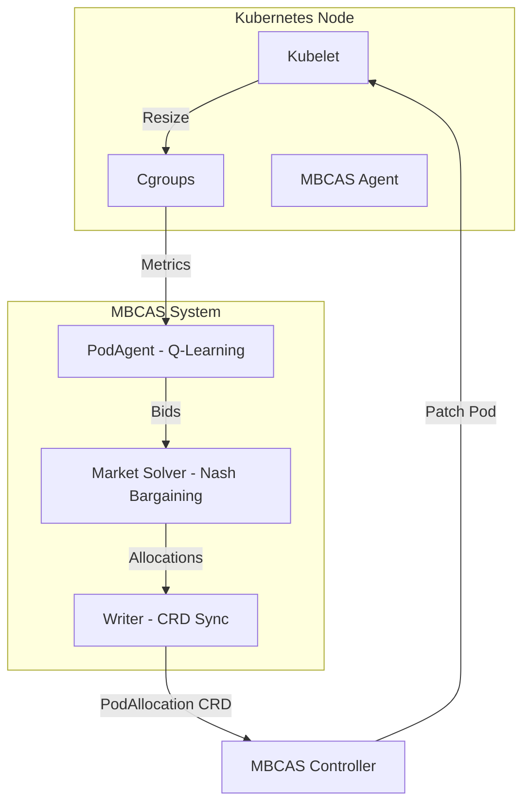

# MBCAS - Market-Based CPU Allocation System

**Competitive Game Theory + Multi-Agent Reinforcement Learning for Kubernetes Resource Optimization**

MBCAS is a Kubernetes-native resource management system where autonomous pod agents compete for CPU resources. It achieves efficient, need-based allocation by combining **Agent-Based Modeling (ABM)** with a **Market-Clearing Mechanism** based on the **Nash Bargaining Solution**.

---

## Authors

- **ALAOUI SOSSE Saad**
- **BOUAZZA Chaymae**
- **BENABBOU Imane**
- **TAQI Mohamed Chadi**

---

## Core Concepts

### 1. Autonomous PodAgents (ABM)
Each pod is managed by a dedicated agent that learns its resource needs over time.
- **State**: `(usage_level, throttle_level, allocation_level)`
- **Actions**: `{aggressive, normal, conservative}` bidding strategies.
- **Learning**: ε-greedy **Q-Learning** with a reward function that penalizes throttling, waste, and oscillations.
- **Adaptation**: Agents adjust their bids based on local metrics (cgroups) and global price signals.

### 2. Market-Based Allocation (Game Theory)
Instead of simple fair-sharing, MBCAS treats CPU capacity as a finite market.
- **Bidding**: Agents submit `Bids` containing their `Demand`, `Weight` (priority), and `Min/Max` constraints.
- **Market-Clearing Mechanism**: A solver allocates resources proportionally to bids when capacity is scarce, matching supply to demand. This achieves efficient need-based allocation (minimizing waste + throttling).
- **Nash Equilibrium (Non-Cooperative)**: Through repeated interactions, agents learn that truthful bidding is the dominant strategy in this competitive game.
- **Shadow Prices**: The mechanism generates a `Shadow Price` representing resource scarcity. Agents use this signal to dampen demand during congestion, further stabilizing the equilibrium.

### 3. Dual-Loop Control
MBCAS maintains cluster stability and responsiveness through two distinct control loops:
- **Fast Loop (2s)**: An emergency guardrail that detects SLO violations or high throttling. It can quickly boost allocations to prevent performance degradation.
- **Slow Loop (15s)**: The main economic optimizer. It runs the full market clearing process, updates Q-tables, and reclaims wasted resources from idle pods.

---

## Architecture



---

## How It Works: The Execution Pipeline

1. **Observe**: The Agent reads cgroup metrics (usage, throttling) and optional SLO data.
2. **Learn**: The `PodAgent` updates its `Q-Table` based on the previous cycle's reward.
3. **Price Discovery**: A "preview" market clearing runs to calculate the current `Shadow Price`.
4. **Bid**: Agents select an action (e.g., "aggressive") and compute their final `Bid`, dampening demand if the `Shadow Price` is high.
5. **Solve**: The `NashBargain` solver distributes the available CPU millicores among all bidders.
6. **Act**: The `Controller` applies the new limits via the Kubernetes **In-Place Pod Vertical Scaling** API.

---

## Configuration

The system is configured via a `ConfigMap` in the `mbcas-system` namespace. Key parameters include:

```yaml
# Control Loop Timing
fastLoopInterval: "2s"
slowLoopInterval: "15s"

# Market Mechanism
totalClusterCPUCapacityMilli: "4000"
systemReservePercent: "10.0"

# Agent Learning
agentLearningRate: "0.1"
agentExplorationRate: "0.2"
```

---

## Getting Started

### Prerequisites
- Kubernetes 1.27+ with `InPlacePodVerticalScaling` feature gate.
- kubectl configured for your cluster.

### Fast Deploy
```bash
make up
```
Launches minikube, builds the images, and deploys the system.

### Enable Management
Label your pods to opt-in to MBCAS:
```yaml
metadata:
  labels:
    mbcas.io/managed: "true"
```

---

## Project Structure

- `cmd/`: Entrypoints for the Agent and Controller.
- `pkg/agent/`: Implementation of `PodAgent` (RL) and node-level orchestration.
- `pkg/allocation/`: Market clearing logic and Nash Bargaining solver.
- `api/v1alpha1/`: `PodAllocation` Custom Resource Definition.
- `config/`: Deployment manifests.

---

**MBCAS**: Where game theory meets container orchestration 🎮🐳
